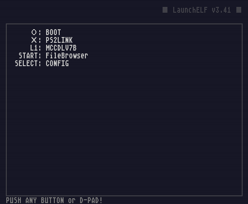
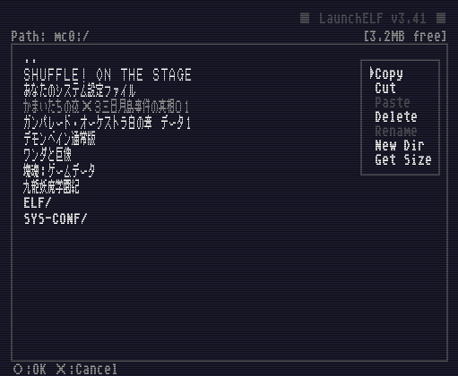
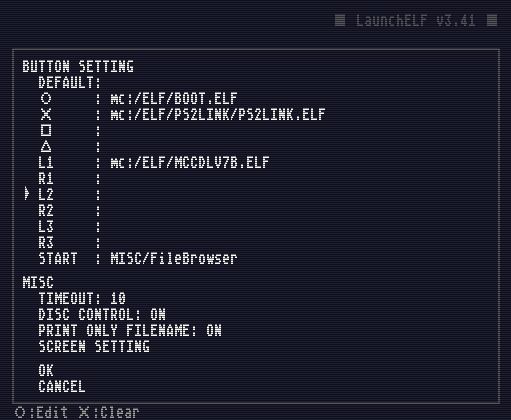
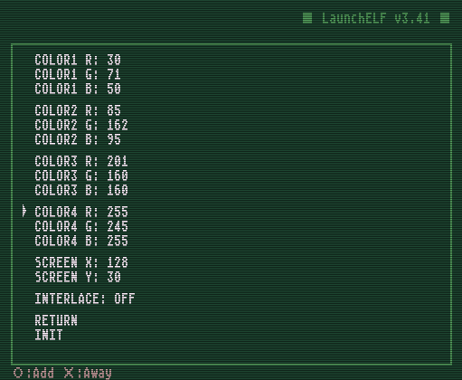

# LaunchELF 
> #### Homenaje a Mirakichi, creador de LaunchELF.

### LaunchELF es descrito por su creador Mirakichi como;
PS2用のELFランチャです。ファイラとしての機能も持ち、PS2HDD、USBマスストレージ（USBメモリ）、CD-ROM/R、メモリーカード上のファイルを相互に読み書きすることができます。

いわゆるメモカブートで使うことを想定していますが、工夫次第ではCD-Rなどに焼いても動作します。

（開発終了）

Traducido al Español:

Este es un lanzador ELF para PS2. También funciona como un archivador y puede leer y escribir archivos en PS2HDD, almacenamiento masivo USB (memoria USB), CD-ROM / R y tarjetas de memoria entre sí.

Está destinado a ser utilizado en el llamado cabolato de notas, pero dependiendo del ingenio, funcionará incluso si se graba en un CD-R o similar.

(Fin del desarrollo)

## ダウンロード / Descargas:
- Pagina oficial:

  [LaunchELF v3.41 Download (124 KB)](http://mirakichi.karou.jp/software/arc/LaunchELF_v3_41.zip)
  
  [LaunchELF v3.41 source code Download (92 KB)](http://mirakichi.karou.jp/software/arc/LaunchELF_v3_41-src.zip)
  
- GitHub (ps2RAWR):

  [LaunchELF v3.41 Download (124 KB)](https://github.com/usaurioRAWR/ps2RAWR/raw/main/LaunchELF/LaunchELF_v3_41.zip)
  
  [LaunchELF v3.41 source code Download (92 KB)](https://github.com/usaurioRAWR/ps2RAWR/raw/main/LaunchELF/LaunchELF_v3_41-src.zip)

## スクリーンショット / Captura de pantalla:

Descripción.

ランチャ画面　ここからコントローラのボタンを押して各機能を呼び出す。

> Pantalla de inicio. Desde aquí, presione el botón del controlador para llamar a cada función.	

Descripción.

ファイルブラウザ画面　メモリーカードの中身を表示した例。

> Pantalla del explorador de archivos. Un ejemplo de visualización del contenido de una tarjeta de memoria.	

Descripción.

コンフィグ画面　ランチャに実行させたいファイルを登録する。

>	Pantalla de configuración. Registre el archivo que desea que ejecute el iniciador.	

Descripción.

カラーコンフィグ画面　配色を変更できる。

> Pantalla de configuración de color. Puede cambiar el esquema de color.

## 既知のバグ / Errores conocidos:
ファイラ機能で0byteのファイルのコピーに失敗します。

このバグは派生版のLbFやuLaunchELFでは修正されているので、そちらを使用しましょう。

Traducido al Español:

Este error se ha corregido en las versiones derivadas de LbF y uLaunchELF, así que vamos a usarlo.

La función de archivador no puede copiar archivos de 0 bytes.

## Fuentes de Información;
### Mirakichi:
- [LaunchELF](http://mirakichi.karou.jp/software/LaunchELF.html)
- [yi](http://sky.geocities.jp/yi4xx/)
  > LaunchELFの改造版LbFのサイト 
  

Traducido al Español:

  

  LaunchELF Mods Sitio LbF
  

  

      
- [nika's wiki](http://nika.osask.tk/?FrontPage)
  > LbFの改造版LbFnのサイト
  

Traducido al Español:

  

  LbF Mods Sitio LbFn
  

  

    
### PS2-HOME:
- [LaunchELF User Guide](https://www.ps2-home.com/forum/app.php/launchelf-user-guide)
